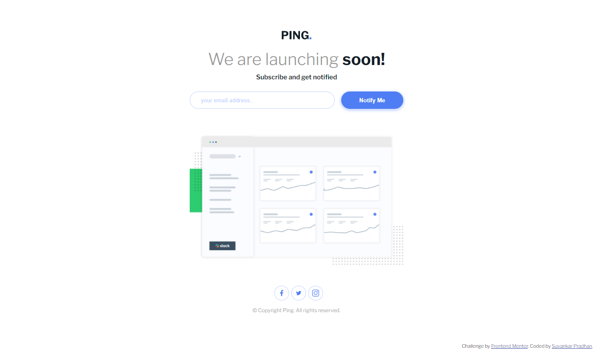

# Frontend Mentor - Ping coming soon page solution

This is a solution to the [Ping coming soon page challenge on Frontend Mentor](https://www.frontendmentor.io/challenges/ping-single-column-coming-soon-page-5cadd051fec04111f7b848da). Frontend Mentor challenges help you improve your coding skills by building realistic projects.

## Table of contents

- [Overview](#overview)
  - [The challenge](#the-challenge)
  - [Screenshot](#screenshot)
  - [Links](#links)
- [My process](#my-process)
  - [Built with](#built-with)
- [Author](#author)

## Overview

HTML + CSS + JS

### The challenge

Users should be able to:

- View the optimal layout for the site depending on their device's screen size
- See hover states for all interactive elements on the page
- Submit their email address using an `input` field
- Receive an error message when the `form` is submitted if:
  - The `input` field is empty. The message for this error should say _"Whoops! It looks like you forgot to add your email"_
  - The email address is not formatted correctly (i.e. a correct email address should have this structure: `name@host.tld`). The message for this error should say _"Please provide a valid email address"_

### Screenshot

### Links

- Solution URL: [Click here](https://github.com/suvankarpradhan/ping-coming-soon-page-master)
- Live Site URL: [Click here](https://suvankarpradhan.github.io/ping-coming-soon-page-master/)

## My process

First create a html, css, and JS file and link them. In html file I create the structure of ping-single-column-coming-soon-page then add some classes for using css and use JS to make site interactive.

### Built with

- Semantic HTML5 markup
- CSS custom properties
- Flexbox
- Jquery

## Author

- Frontend Mentor - [@suvankarpradhan](https://www.frontendmentor.io/profile/suvankarpradhan)
